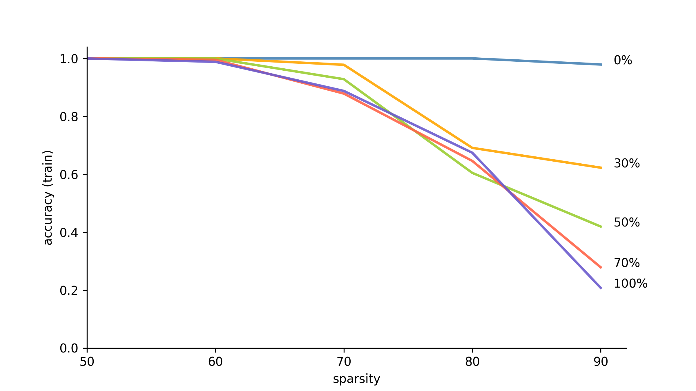

# Randomization and compression

This directory contains scripts to explore the connection between compressibility and generalization by attempting to prune
networks trained on progressively randomized datasets. The `train_resnet_random.py` file provides code to train a ResNet model
on the CIFAR-10 dataset with an arbitrary level of label randomization. The output may then be passed to the
`prune_resnet_dns.py` script to prune the model to a given target sparsity.

In general, we observe that as the label randomization increases, the training accuracy of the compressed models degrade
more quickly as a function of the compression ratio imposed to the network.

To be more specific on experiment details:

### Convert CIFAR-10 to TFRecode file
You need to execute this script [download\_and\_convert\_cifar10.py](https://github.com/tensorflow/models/blob/master/research/slim/datasets/download_and_convert_cifar10.py) to convert CIFAR-10 to TFRecode data files: `cifar10_train.tfrecord` and `cifar10_test.tfrecord`.

### Train ResNet-56 on CIFAR-10 with different levels of label randomization

Randomly label some portion (0%, 30%, 50%, 70%, 100%) of CIFAR-10 training data, the train ResNet-56 on this noisy training data. *i.e.* 
Execute `train_resnet_random.py` with `--proportion-random` parameter taking [0.0, 0.3, 0.5, 0.7, 1.0].

```
python3 train_resnet_random.py train --dataset cifar10_train.tfrecord --train-dir out-100 --proportion-random 1.0
python3 train_resnet_random.py train --dataset cifar10_train.tfrecord --train-dir out-30 --proportion-random 0.3
python3 train_resnet_random.py train --dataset cifar10_train.tfrecord --train-dir out-50 --proportion-random 0.5
python3 train_resnet_random.py train --dataset cifar10_train.tfrecord --train-dir out-70 --proportion-random 0.7
python3 train_resnet_random.py train --dataset cifar10_train.tfrecord --train-dir out-0 --proportion-random 0.0
```

### Prune trained model with different sparsity

To prune model trained on CIFAR-10 with 30% label randomization to 50% sparsity, *e.g.*

```
python3 prune_resnet_dns.py eval \
--dataset cifar10_test.tfrecord \
--train-dir out-prune-30-5 \
--target-sparsity 0.5 \
--warm-start out-30 \
--max-steps 20000
```

For convinience, we add `run.py` so that you can simply `python3 run.py train 0.3 20000` to loop through sparsity of [0.5, 0.6, 0.7, 0.8, 0.9], and evaluate the TRAINING ACCURACY with `python3 run.py eval 0.3 20000`.

Note: here when evaluating the training accuracy, since the data is partially randomly labelled, we use the same random seed for `train` and `eval` to gaurantee the data are the same. Otherwise the results won't be `training` accuracy.


### Experiments runtime

For each random seed, we need to train model with 5 levels of label randomization (0%, 30%, 50%, 70%, 100%), each pruned to 5 levels of sparsity (0.0, 0.3, 0.5, 0.7, 1.0), it takes around `2.5 * 5 = 12.5` hours on AWS p3.2xlarge GPU instance. 

### Plot summary

Since the experiments runtime is long, then we only perform experiments with 3 random seeds, and get the following figure (`plot_summary.py`), which is similar as Figure 1 in the paper.


### Conclusion

In contrast to prevoius experiments on generalization bounds, which shows 

- compression results directly imply generalization bounds

This experiment serves as the **randomization tests** (motivated by [Zhang et al. (2017a)](https://arxiv.org/pdf/1611.03530.pdf)) to show empirically that 

- **overfitting implies a limit on compressibility**. *i.e.* If a model tends to overfit then there is an absolute limit on how much it can be compressed.

We can conclude the above by observing from the experiments that: the model trained on more highly randomized data demonstrates worse compressibility. Note that *i)* if the data is more highly randomized, then the trained model will be more overfitting; *ii)* the training accuracy of the model with worse compressibility decreases quickly as the model sparsity increases. *i.e.* increased overfitting implies worse compressibility, for a fixed compression scheme. 

*Note: here, the generalization error is given by the fraction of examples that have been randomly relabeled.*